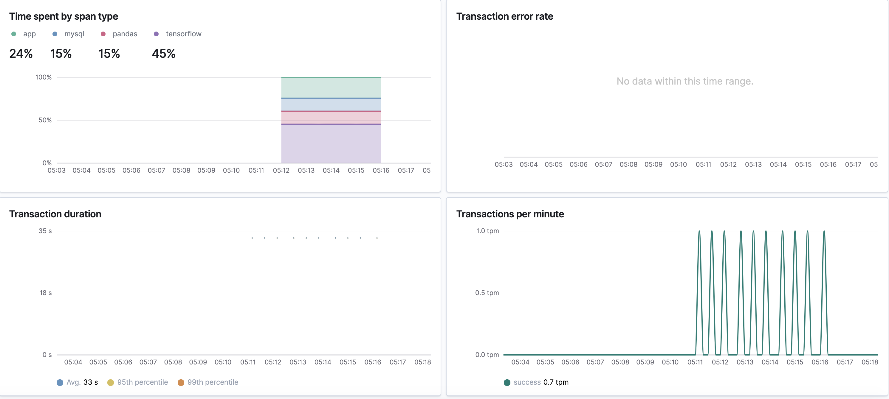
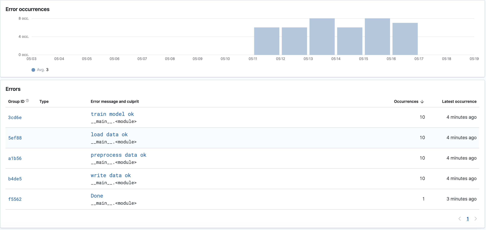
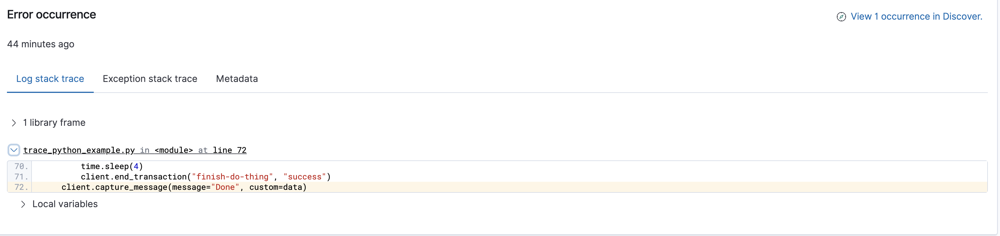
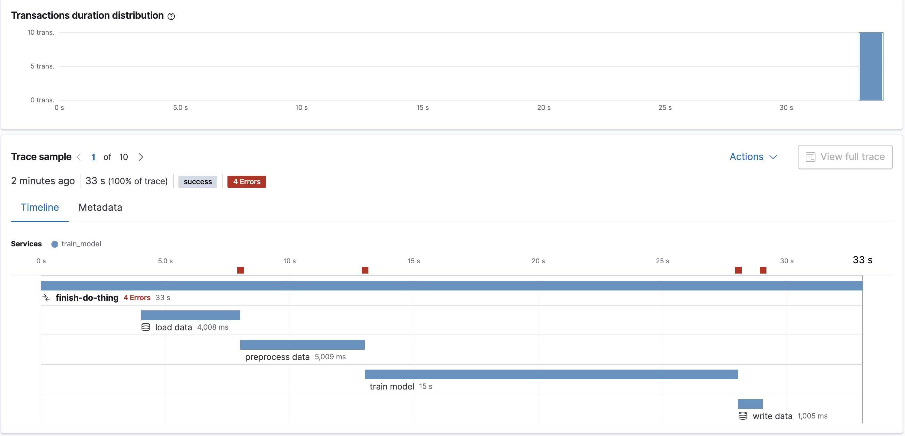
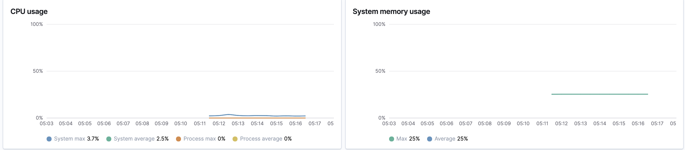
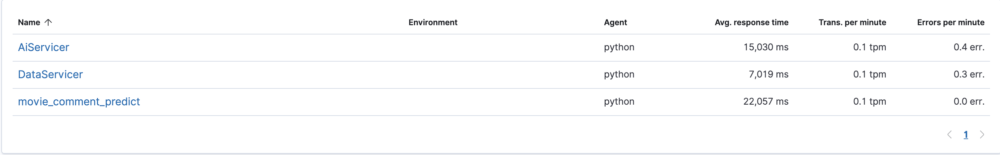
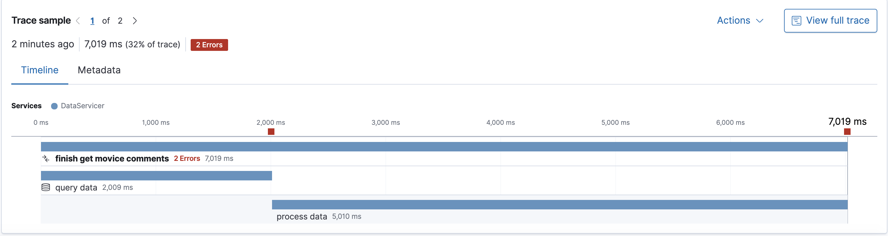
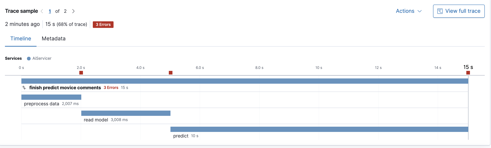
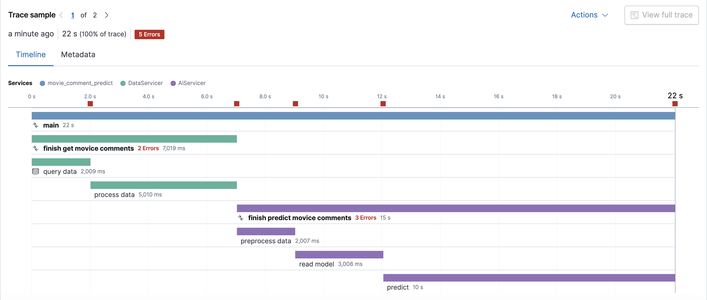

# Elastic-APM-note
## OpenTracing
在軟體架構中漸漸從原本的Monolit轉換成Ｍicroservices的架構，程式的呼叫變為跨進程服務間的RPC調用，運維和問題排查相對於單體系統也變得更加複雜和困難，APM因此而生。為了更加高效定位和排查在這種分佈式服務架構體系下的問題追踪和分析，誕生了一批相應的產品和系統，包括集中式日誌系統（Logging），集中式度量系統（Metrics）和分佈式追踪系統（Tracing）
### Logging，Metrics 和 Tracing

* Logging: 用於記錄離散的事件。代表的公司(產品)有Splunk, Elastic(ELK), etc
* Metrics: 用於記錄可聚合的數據。代表的公司(產品)有SoundCloud(Prometheus), etc
* Tracing: 用於記錄請求範圍內的信息。代表公司(產品)有Datadog，Zipkin, etc

### OpenTracing規範

* Trace: 調用鏈，一條Trace（調用鏈）可以被認為是一個由多個Span組成，例如客戶端的一個請求
* Span: 跨度，可以被理解為一次方法調用，一個程序塊的調用，或者一次RPC/數據庫訪問。只要是一個具有完整時間週期的程序訪問，都可以被認為是一個span
* Span Context: 分佈式調用跟踪的上下文信息，包括Trace id，Span id以及其它需要傳遞到下游服務的內容。通過span context，把不同進程裡的span關聯到相應的trace上。 span context可以基於不同的方式進行傳遞，比如Http header。

以Elastic APM為例，我們可以看到trace id和span id在http header中以elastic-apm-traceparent進行傳遞（中間先後是trace id和span id）：
## Elastic APM介绍
### Elastic APM 架構

### Elastic APM Components
* APM Agent : 提供多種語言支持，如javascript，python，java，go等。
* APM Server : 接收和轉換來自APM Agent發來的數據
* Elasticsearch : 接收和存儲來自APM服務器的數據
* Kibana APM UI : 可視化性能數據
## Install & Setup
```
cd deploy
docker-compose up -d
```
## Single Trace App Example
這個範例只追蹤一個應用程式（one service)
```
python3 trace_single_app_example/trace_python_example.py
```
如下圖，左上區塊是一個tansaction內每個span花費的時間比例，左下圖為平均每個transaction花費的時間，右下圖為平均每分鐘執行多少次transaction。

下圖為此transaction記錄下來的erro message

Elastic APM也能定位到error log行數

下圖為transaction視圖

下圖為transaction使用的CPU、MEMORY

## Trace GRPC Microservices Example(Distributed tracing)

分佈式跟踪使您能夠在一個視圖中分析整個微服務架構的性能這是通過跟踪所有請求-從一開始在DataService請求資料-到AiService進預測，這使得可以在整個應用程序中查找性能的瓶頸在於哪部分。

1. run DataService
```
PYTHONPATH=`pwd` python3 trace_grpc_microservices_example/DataService/server.py
```
2. run AiService
```
PYTHONPATH=`pwd` python3 trace_grpc_microservices_example/AiService/server.py
```
3. run trace code
```
PYTHONPATH=`pwd` python3 trace_grpc_microservices_example/trace.py
```
Result
```
DataService client received: the movie is bad
AiService client received: Predict: the movie is bad
```
All Services

Trace DataService

Trace AiService

Trace Transaction

## Reference
* [apm-agent-python github](https://github.com/elastic/apm-agent-python)
* [Elastic APM PYTHON API reference](https://www.elastic.co/guide/en/apm/agent/python/current/api.html)
* [Elasticsearch, Kibana, and APM Server up and running in Docker.](https://www.elastic.co/guide/en/apm/get-started/current/quick-start-overview.html)
* [How to monitor your python code using Elastic APM](https://toptechtips.github.io/2019-07-08-add_python_code_to_apm/)
* [Elastic：菜鳥上手指南](https://blog.csdn.net/UbuntuTouch/article/details/102728604)
* [Elastic：菜鳥上手指南](https://blog.csdn.net/UbuntuTouch/article/details/102728604)
* [How to instrument a polyglot microservices application with Elastic APM](https://www.elastic.co/blog/how-to-instrument-a-polyglot-microservices-application-with-elastic-apm)
* [Set trace information to new transaction](https://discuss.elastic.co/t/set-trace-information-to-new-transaction/180185/5)
* [Distributed Tracing with APM server; with Python](https://github.com/elastic/apm-agent-python/issues/712)
