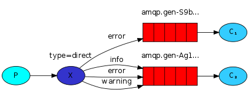

# RabbitMQ

## Introduction
AMQP，即 Advanced Message Queuing Protocol，高階訊息佇列協議，是應用層協議的一個開放標準，為面向訊息的中介軟體設計。訊息中介軟體主要用於元件之間的解耦和通訊。

AMQP的主要特徵是面向訊息、佇列、路由（包括點對點和釋出/訂閱）、可靠性、安全。

RabbitMQ是一個開源的AMQP實現，伺服器端用 Erlang 語言編寫，支援多種客戶端，如：Python、Ruby、.NET、Java、JMS、C、PHP、ActionScript、XMPP、STOMP等，支援AJAX。用於在分散式系統中儲存轉發訊息，具有很高的易用性和可用性。

# Term and Concept
* Queue.

    存放訊息的地方,跟一般資料結構的Queue一樣具有fist-in-first-out特性，且每個Queue都有自己的id
* Producer.

    負責將訊息丟到Queue裡面，若有定義Exchange，則通過Exchange決定要進哪個Queue
* Consumer.

    負責接收Queue裡面的訊息
* Exchange.

    用來決定Producer丟過來的資料要送給哪個Queue，主要有四種方式
    
    1. direct: 直接丟給指定的 Queue

        
        
        [Work queue code](./work_queue)
    
    2. topic: 類似 regular expression，設定 binding 規則，丟給符合的 Queue

        

        [Topics code](./Topics)

        Submit logs related to kern topics

        
        Submit logs related to critical topics
        
        
    3. routing: 透過傳送資料的 routing key 來特別指定所要的 Queue

        

        [Routing code](./Routing)

    4. fanout: 一次丟給全部負責的 Queue

        

        [Publish-Subscribe code](./Publish-Subscribe)
* Binding.

    跟 Exchange 成對搭配，主要是告訴 Exchange 他負責哪些 Queue

# Common commands
1. list queues
```
rabbitmqctl list_queues
```
2. list jobs by queue name
```
rabbitmqadmin get queue=document_analysis requeue=true count=10
```

# Tips
* Setting Message durability

    1. make message persistent
        ```
        channel.basic_publish(exchange='',
                      routing_key="task_queue",
                      body=message,
                      properties=pika.BasicProperties(
                         delivery_mode = 2, # make message persistent
                      ))
        ``` 
    2. make queue persistent
        ```
        channel.queue_declare(queue='task_queue', durable=True)
        ```
* Fair dispatch

    調度無法完全按照我們的要求進行。例如在有兩名工人的情況下，當奇數的消息都很重，而偶數消息很輕時，一位工人將一直忙碌而另一位工人將幾乎不做任何工作。RabbitMQ對此一無所知，並且仍將平均分派消息。

    發生這種情況是因為RabbitMQ在消息進入隊列時才調度消息。 它不會查看消費者的未確認消息數。 它只是盲目地將每第n條消息發送給第n個使用者。

    

    為了解決這個問題，我們可以將Channel＃basic_qos通道方法與prefetch_count = 1設置一起使用。這使用basic.qos協議方法來告訴RabbitMQ一次不向工作人員發送多條消息。
    ```
    channel.basic_qos(prefetch_count=1)
    ```
* Consumer Ack/Reject

    首先，我們先看下這樣的業務場景，在訊息發出後， Consumer 接收到了生產者所發出的訊息，但在 Consumer 突然出錯崩潰，或者異常退出了，但是生產者訊息已經發出來了，那麼這個訊息可能就會丟失，為了解決這樣的問題， RabbitMQ 引入了 ack 機制。 消費者在訂閱佇列時，可以指定 autoAck 引數，當 autoAck 等於 false 時， RabbitMQ 會等待消費者顯式地回覆確認訊號後才從記憶體(或者磁碟)中移去訊息(實質上是先打上刪除標記，之後再刪除)。當 autoAck 等於 true 時， RabbitMQ 會⾃自動把傳送出去的訊息置為確認， 然後從記憶體(或者磁碟)中刪除，而不管消費者是否真正地消費到了這些訊息。 當採用ack訊息確認機制後，只要將 autoAck 設定為 false 。消費者就可以有足夠的時間來處理訊息，而不用擔心消費過程中突然異常退出導致訊息丟失的情況，因為 RabbitMQ 會一直持有訊息，直到消費者呼叫 basic.ack 為止。在這種情況下，對於 RabbitMQ 來說，佇列中的訊息就可以分為兩部分，一部分是等待發送給消費者的訊息，另外一部分就是等待接收消費者確認的訊息。那麼如果在這個時候，消費者突然發生中斷，在消費中的訊息會怎麼處理呢？ 如果 RabbitMQ 一直沒有接收到消費者的確認訊息，並且消費者的連線已經關閉，那麼 RabbitMQ 就會重新將讓訊息進入佇列中，等待下一個消費者消費。 RabbitMQ 不會為未確認的訊息設定過期時間，它判斷此訊息是否需要重新投遞給消費者的唯一依據是消費該訊息的消費者連線是否已經斷開。 參考如下程式碼，我們設定了 auto_ack=True ：
    ```
    import pika
    from time import sleep

    user_pwd = pika.PlainCredentials('admin', 'admin')
    connection = pika.BlockingConnection(
        pika.ConnectionParameters(host='localhost', credentials=user_pwd))
    channel = connection.channel()

    channel.queue_declare(queue='hello', durable=True)


    def callback(ch, method, properties, body):
        print(" [x] Received %r" % body)
        sleep(1)

    channel.basic_consume(
        queue='hello', on_message_callback=callback, auto_ack=True)

    print(' [*] Waiting for messages. To exit press CTRL+C')
    channel.start_consuming()
    ```
    可以看到，如果我們設定 auto_ack=True 之後，雖然我們在消費的時候有休眠1s，而且這個時候訊息還沒有全部消費完，但是在後臺看到佇列中的訊息已經被消費完了，這個原因是當消費者連線上隊列了，因為沒有指定消費者一次獲取訊息的條數，所以佇列把佇列中的所有訊息一下子推送到消費者端，當消費者訂閱的該佇列，訊息就會從佇列推到客戶端，當訊息從佇列被推出的時的那一刻就表示已經對訊息進行自動確認了，訊息就會從佇列中刪除。 下面我們再看看設定 auto_ack=False 的情況：
    ```
    import pika
    from time import sleep

    user_pwd = pika.PlainCredentials('admin', 'admin')
    connection = pika.BlockingConnection(
        pika.ConnectionParameters(host='localhost', credentials=user_pwd))
    channel = connection.channel()

    channel.queue_declare(queue='hello', durable=True)

    def callback(ch, method, properties, body):
        print(" [x] Received %r" % body)
        sleep(1)

    channel.basic_consume(
        queue='hello', on_message_callback=callback, auto_ack=False)

    print(' [*] Waiting for messages. To exit press CTRL+C')
    channel.start_consuming()
    ```
    執行結果如下：
    
    可以看到，佇列中的訊息都變成了 unacked 狀態，這是為什麼呢？ 我們上面有說過， rabbitmq 需要等到消費者顯示的呼叫 basic.ack ，要不然的話 rabbitmq 會一直持有這些訊息，如果我們在這個時候再啟動一個消費者的話，可以看到這些訊息還會再次被消費。為了解決這個問題，我們只要修改下 callback 方法如下：
    ```
    def callback(ch, method, properties, body):
        print(" [x] Received %r" % body)
        sleep(1)
        # delivery_tag 是在 channel 中的一個訊息計數, 每次訊息提取行為都對應一個數字.
        ch.basic_ack(delivery_tag=method.delivery_tag)
    ```
    就可以，這時，我們重啟消費者，可以看到我們的訊息會被正常的消費，並且佇列中訊息的不會被瞬間清空，而是按照我們的消費速度一個一個的刪除。 消費者在接收到訊息之後，還可以拒絕訊息，我們只需要呼叫 basic_reject 就可以，如下:
    ```
    def callback(ch, method, properties, body):
        print(" [x] Received %r" % body)
        sleep(1)
        # delivery_tag 是在 channel 中的一個訊息計數, 每次訊息提取行為都對應一個數字.
        ch.basic_reject(delivery_tag=method.delivery_tag, requeue=False)
    ```
    requeue 引數的意思是被拒絕的這個訊息是否需要重新進入佇列，預設是 True 。

* priority job

    [code](./DelayDeadLetterExchange)
* solved Immediate Re-queueing

    [Delay Dead Letter Exchange](https://medium.com/@lalayueh/%E5%A6%82%E4%BD%95%E5%84%AA%E9%9B%85%E5%9C%B0%E5%9C%A8rabbitmq%E5%AF%A6%E7%8F%BE%E5%A4%B1%E6%95%97%E9%87%8D%E8%A9%A6-c050efd72cdb)

    [code](./DelayDeadLetterExchange)

## Reference
* [RabbitMQ tutorial](https://www.rabbitmq.com/tutorials/tutorial-one-python.html)
* [如何優雅地在RabbitMQ實現失敗重試](https://medium.com/@lalayueh/%E5%A6%82%E4%BD%95%E5%84%AA%E9%9B%85%E5%9C%B0%E5%9C%A8rabbitmq%E5%AF%A6%E7%8F%BE%E5%A4%B1%E6%95%97%E9%87%8D%E8%A9%A6-c050efd72cdb)
* [RabbitMQ學習筆記之(二) 消費端的確認與拒絕
](http://ma-graph.org/sparql-endpoint/)
* [RabbitMQ系列之三 RabbitMQ几种典型模式](https://blog.csdn.net/caiqing116/article/details/84032099?utm_medium=distribute.pc_relevant.none-task-blog-BlogCommendFromBaidu-1.control&depth_1-utm_source=distribute.pc_relevant.none-task-blog-BlogCommendFromBaidu-1.control)
* [Deduplication](https://github.com/noxdafox/rabbitmq-message-deduplication/issues/21)
